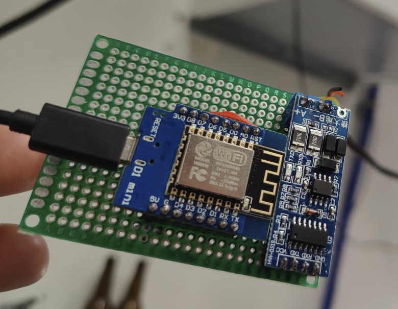

# esphome-enervent-eda
ESPHome Enervent EDA

This project is used to control the Enervent EDA over ESPHome.

#### Hardware used in this project:
- Wemos D1 Mini (later just Wemos)
- TTL-MAX485 converter
- AHU with Enervent EDA automation
- RJ14 cable to connect EDA automation to TTL converter. Same cable/connector as used in the Enervent EDA panel.
- proto board, screw terminals, pin headers and wires to make internal connections on board
- micro usb cable with power

#### Config
- enervent.yaml (configuration file for ESPHome)
- Wemos **TX pin** GPIO15 (**D8**) -> **TX pin** of TTL converter
- Wemos **RX pin** GPIO13 (**D7**) -> **RX pin** of TTL converter
- Wemos **5V pin** -> **VCC pin** of TTL converter
- Wemos **G pin** -> **GND pin** of TTL converter
- RJ14 cable **Green** wire -> converter **A+** (NOTE: you have to find out these if using a different cable/connector)
- RJ14 cable **Yellow** wire -> converter **B-** (NOTE: you have to find out these if using a different cable/connector)
- Added screw terminal to TTL converter to help connect wires from AHU (Air Handling Unit).
- Wemos and TTL converter is combined to proto board with headers to help maintenance.

#### Links

- TTL-MAX485 converter: https://www.aliexpress.com/item/1005001346792286.html

#### Images
Wemos TTL proto:

